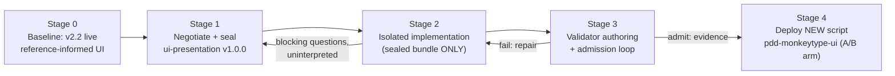
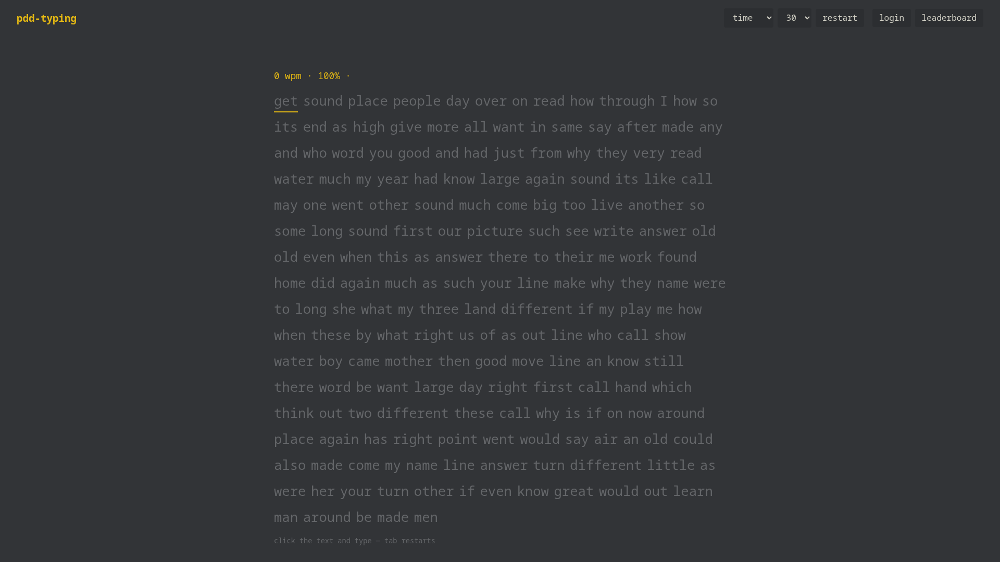
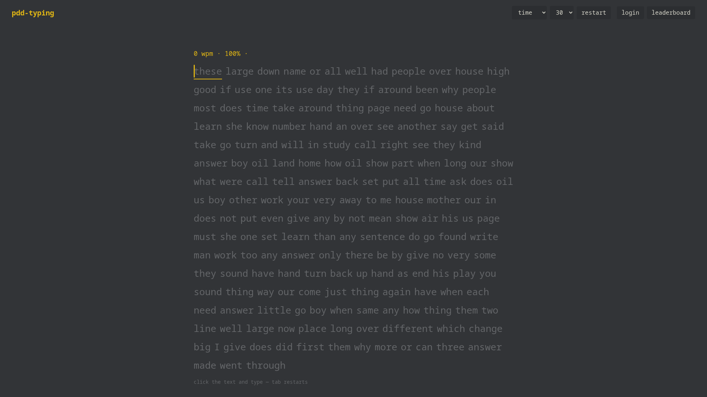

# Protocol-Driven Development × Visual Design: A Two-Tier Contract for Persistent Visual Intent

## Abstract

Protocol-Driven Development (PDD) governs generated software through sealed invariant protocols, but its demand for machine-checkable exactitude sits uneasily with visual design, which carries persistent intent yet resists precise protocolization. We ask how transient cosmetic decisions with some persistent consistency requirements can be absorbed into PDD with minimal friction. We report a full-lifecycle case study on the pdd-monkeytype typing-test system: a two-tier contract — sealed machine-checkable presentation invariants (DOM structure, engine-coupled behavior, computed-style constraints) plus a design-token charter of named tokens with tolerance bands — was negotiated under an interpretive firewall in which the orchestrator shapes visuals only through negotiation with the protocol author, never by instructing implementers. The bundle sealed after 2 negotiation rounds with 14 `must` and 3 `should` invariants, 1 version event, and 4 blocking questions adjudicated in a single round; negotiation surfaced and repaired a contradiction inside the stakeholder's own intent set (a 4.5 contrast floor versus a reference palette measuring 2.70:1). The isolated implementation raised 0 blocking questions; the headless-Chromium validator suite (WCAG/HSL mathematics, canvas `measureText`, MutationObserver confinement, engine-oracle fuzzing, host-pinned screenshot similarity) admitted the candidate on iteration 1 in 92.9 s, with screenshot coherence of 0.999897 and 0.9996 against a 0.85 similarity floor, and the build deployed as a live A/B arm alongside the untouched baseline. A palette defect both negotiating parties missed — an *unverified admission claim*, which we name as a new defect class — was absorbed inside the contract's delegated space at zero friction cost. The results suggest that what makes visual intent protocolizable is precision about which decisions are persistent, not precision about pixels.

## 1. Introduction

### 1.1 Background and Motivation

Protocol-Driven Development (PDD) inverts the conventional relationship between specification and code: the protocol — a sealed bundle of structural, behavioral, and operational invariants with typed handshakes, validator mappings, and evidence requirements — is the primary engineering artifact, and implementations are admitted only when machine-checked validators produce signed evidence of conformance [1]. In the PDD reference architecture, "generation proposes; validation decides": an implementation generator never self-declares validity, and admission is an evidence-chained event over the tuple of protocol, implementation, validators, and results [1]. The approach has been positioned as a governance answer to generated software, where the volume and opacity of machine-written code make review-centric quality assurance untenable [2].

PDD's strength is precisely its demand for exactitude — and that demand is also its boundary. Visual design is a counterexample waiting to happen. A user interface carries genuine persistent intent (the word stream must read in order; error states must be perceptually distinct; the palette must remain a dark, red-accented family), but that intent resists exact protocolization: pixel-perfect sealing would freeze every cosmetic decision into the contract and destroy implementer latitude and candidate substitutability, while pure delegation would lose the coherence that makes the product recognizable. Whether a presentation layer can be absorbed into PDD without either failure mode — friction explosion on one side, coherence collapse on the other — is an open, empirical question.

### 1.2 Research Gap and Problem Statement

The pdd-monkeytype project previously applied PDD to a seven-protocol typing-test system derived from the monkeytype reference application, covering engine semantics, results, accounts, configuration, quotes, leaderboards, and anticheat — all non-visual concerns (`docs/02-protocol-derivation.md`, `docs/08-retrospective.md`). The presentation layer was deliberately left outside the sealed perimeter. This paper reports the follow-on experiment that protocolized it (`/mnt/agents/work/plan-ui-research.md`). The research question: *how can transient, non-essential decisions (visual design) with some persistent consistency requirements be absorbed into PDD with minimal friction?* The problem statement is concrete and falsifiable: define a contract that (i) carries persistent visual intent in machine-checkable form, (ii) leaves transient cosmetics to implementer latitude, and (iii) keeps measured friction — negotiation rounds, blocking questions, version events, validator cost — within pre-registered budgets, failing which the approach is rejected.

### 1.3 Contributions

This paper makes four contributions, each grounded in the project's recorded artifacts.

#### 1.3.1 A two-tier contract for visual intent (H1)

We define and seal a contract splitting visual intent into (i) machine-checkable presentation invariants — DOM-structural assertions, behavioral coupling to engine handshakes, and computed-style constraints such as WCAG contrast floors — and (ii) a design-token charter of named CSS custom properties governed by tolerance bands rather than exact values (`protocols/ui-presentation/`). The sealed bundle carried 14 `must` and 3 `should` invariants, and its delegated space subsequently absorbed a real palette defect at zero friction cost (§5.2.2).

#### 1.3.2 Negotiation-scoped orchestration as a friction-control mechanism (H2)

We operationalize a hard rule — the orchestrator affects visuals only by negotiating with the protocol author, never by instructing implementers on interpretation — and account its friction: 2 negotiation rounds, 4 blocking questions all adjudicated in a single round, 1 version event, and 0 blocking questions during implementation (`research/negotiation/`, `research/implementation/blocking-questions.md`).

#### 1.3.3 A costed validator toolchain for presentation

We show that presentation invariants are economically machine-checkable with a specific toolchain — headless-Chromium computed-style assertion, WCAG luminance and RGB→HSL mathematics, canvas `measureText` monospace checks, MutationObserver mutation confinement, an engine-oracle keystroke fuzzer, and host-pinned screenshot similarity with explicit tolerance bands — admitting the candidate on iteration 1 in 92.9 s (`research/metrics/validator-loop.md`).

#### 1.3.4 An honest defect and failure record

We report the failures as faithfully as the successes: an internal contradiction in the stakeholder's own intent set surfaced only by the counterparty (P2); an *unverified admission claim* that both parties missed and that a new defect class is required to name (PSN-UI-01); two pre-existing implementation defects exposed by the sealed invariants (R1/R2); and 10 protocol-text insufficiencies found during validator authoring (`research/negotiation/round-03-postsealing-note.md`, `research/metrics/validator-authoring.md`).

### 1.4 Paper Organization

Section 2 reviews PDD, the critical-ambiguity mechanism, and the host system. Section 3 states the hypotheses, the design options compared, and the metrics. Section 4 describes the negotiation method and friction accounting. Section 5 reports results stage by stage, including the deployment arm. Section 6 interprets the findings and their tradeoffs. Section 7 lists threats to validity, Section 8 future work, and Section 9 concludes.

## 2. Background

### 2.1 Protocol-Driven Development

#### 2.1.1 Sealed invariant bundles

PDD specifies each system concern as a protocol $P = (S, B, O)$: structural invariants (shapes, schemas, vocabularies), behavioral invariants (input–output properties, often property-tested), and operational invariants (resource, latency, and deployment constraints) [1]. Each invariant carries an identifier, a natural-language statement, a severity (`must` or `should`), a rationale, and a mapping to at least one validation mechanism. Bundles additionally declare typed handshakes (JSON Schemas) at their dependencies, a capability manifest, a validation plan, and evidence requirements; a structural linter enforces bundle hygiene before sealing. A sealed bundle is immutable: corrections arrive only through versioned re-negotiation ("version events"), never through silent text edits [1]. The pdd-monkeytype repository realizes this anatomy directly — see, for the bundle studied here, `protocols/ui-presentation/protocol.yaml` and `protocols/ui-presentation/invariants/{structural,behavioral,operational}.yaml`.

#### 2.1.2 Validator loops and evidence

Admission is decided by executable validators, not by review. A candidate implementation runs through layered validator suites (structural → behavioral → operational); every check emits a machine-readable result, and admission produces a signed evidence record over protocol version, implementation artifact hash, validator versions, and results — $E = H(P, I, V, R, t)$ [1]. The governing discipline is asymmetric: the implementation generator proposes, the sealed validators decide, and nothing is admitted on the strength of looking correct (`docs/08-retrospective.md` §1). This asymmetry is what makes PDD attractive for generated software, where the author of the code is an agent whose self-assessment cannot be trusted [2]. It is also what makes PDD hard to apply to visuals: a validator cannot assert "looks right" — it can only assert measurable proxies, so the methodological crux is choosing proxies that carry intent.

### 2.2 Critical Ambiguity and the CA-001 Mechanism

#### 2.2.1 The taxonomy

Natural-language invariants are ambiguous, and PDD's answer is not to ban ambiguity but to classify and route it. The mechanism, built into the project's protocol-authoring discipline after the CA-001 incident, distinguishes **cosmetic** ambiguities (all readings yield the same observable behavior — safe to resolve by assumption and log) from **critical, behavior-changing** ambiguities (readings produce materially different observable behavior). For critical items the rules are: ask a reference or human adjudicator rather than silently assume; if forced to proceed, record the competing readings, the chosen reading, and a revealing test that would expose a wrong choice; and a wrong critical reading discovered after sealing triggers a remediation loop — a version event, never a silent edit (`docs/10-critical-ambiguity-CA-001.md`).

#### 2.2.2 The CA-001 precedent

The mechanism's reference case arose in the typing-test engine protocol. Invariant B-ENG-005 v1.0.0 stated that backspace "never moves before the start of the current word"; two defensible readings of "current word" produced materially different retreat behavior, and the wrong reading had been silently implemented. Post-admission evidence (a user report, reconciled against the reference handler `before-delete.ts`) triggered remediation: the invariant was amended to say exactly what the reference does (retreat into the immediately previous committed word iff that word contains an error; fully correct words are sealed), the engine protocol was re-sealed as v1.1.0, three property tests were added, and the full loop re-admitted (`docs/10-critical-ambiguity-CA-001.md`). CA-001 matters to the present study for two reasons: it is the triage mechanism that hypothesis H2 relies on for blocking-question classification, and it is the lens through which the presentation-layer conflict P2 and the post-sealing note PSN-UI-01 were classified (§5.2).

### 2.3 The pdd-monkeytype System

#### 2.3.1 Prior work: seven sealed protocols, no visuals

The host system is a typing-test application derived from the monkeytype reference (v26.28.0; `docs/02-protocol-derivation.md`). Seven protocol bundles were negotiated and sealed — typing-test-engine, test-results, user-account, user-config, quote-library, leaderboards, result-anticheat — with deliberate simplifications recorded (JSON-file persistence, HMAC tokens, anticheat limited to observable admission semantics). The first implementation was admitted on all seven protocols after 6 validator-loop iterations, with a defect ledger of 2 implementation defects, 3 harness/validator defects, 1 configuration gap, and 1 runtime blind spot found by manual testing and later promoted into a protocol minor version (O-RES-004, test-results v1.1.0) (`docs/08-retrospective.md`). Fault attribution is the salient background fact: zero defects traced to protocol authoring, which the retrospective credits to mediated Q&A and pre-code contract negotiation. The visual layer, however, was inherited informally from the reference aesthetic and governed by no protocol.

#### 2.3.2 Two candidates and a live baseline

The system demonstrates protocol-level substitutability: two candidate implementations — Node/Express with JSON persistence and a Cloudflare Workers port backed by KV — are admitted against the same sealed bundles with zero re-negotiation, the protocol-critical modules byte-identical between them (`docs/09-cloudflare-deployment.md`). The Workers candidate (v2.2) is live at `https://pdd-monkeytype.pdd-typing.workers.dev` and serves as the reference-informed visual baseline for the present study: it embodies the target aesthetic (dark background `#323437`, yellow accent `#e2b714`, red error `#ca4754`) while pre-dating any presentation protocol. Deployment of new candidate versions follows a KV-staged, hash-gated pattern in which script bundles are assembled from verified chunks inside the deploy call — a pattern adopted after a lossy paste channel silently corrupted two string literals in an earlier deployment (`docs/09-cloudflare-deployment.md`, postmortem addendum). The present experiment's stage 4 reuses this pattern to deploy the UI-conformant build as a *new* Worker script, keeping v2.2 live for A/B comparison (§5.6).

## 3. Hypotheses and Design

### 3.1 H1 — The Two-Tier Contract

The first hypothesis concerns the shape of the contract itself (`/mnt/agents/work/plan-ui-research.md`):

> **H1.** A two-tier contract — (i) sealed, machine-checkable presentation invariants (DOM-structural assertions; behavioral coupling to engine handshakes; computed-style constraints such as WCAG contrast floors) plus (ii) a bounded design-token charter (named tokens with tolerance bands, not exact values) — can carry persistent visual intent through PDD while transient cosmetics stay delegated to implementer latitude.

#### 3.1.1 Tier 1: machine-checkable presentation invariants

Tier 1 pins what a machine can decide: the word stream exists as one element per engine target word in reading order (S-UI-001); every letter carries at most one state class from a sealed vocabulary `{correct, incorrect, extra}` (S-UI-002); exactly one active word tracks the engine's `wordIndex` (S-UI-003); a caret element tracks a *defined* logical caret position within 2 px after every keystroke (B-UI-001); per-letter classes equal the engine's accounting after every keystroke (B-UI-002); committed words are not re-rendered (B-UI-003, formulated as mutation confinement); the results view renders the CompletedEvent payload exactly (B-UI-004) (`protocols/ui-presentation/invariants/`). The common move is to seal *mechanism* (a DOM class, a defined position, an exact value) while delegating *style* (how the active word is decorated, what the caret looks like).

#### 3.1.2 Tier 2: the design-token charter

Tier 2 carries palette-level intent without freezing it: seven token *names* are sealed on `:root` (`--bg --main --caret --text --sub --error --error-extra`, S-UI-004), while token *values* are delegated within bands — WCAG contrast floors (text ≥ 4.5, error and caret ≥ 3.0 with a large-text clause, O-UI-001), a dark-family luminance band with a red error hue/saturation band (O-UI-002), pairwise four-state color distinction of ≥ 32 max-channel delta (O-UI-003), and monospace advance equality within 1 px (O-UI-004) (`protocols/ui-presentation/invariants/operational.yaml`). A single screenshot-coherence invariant (O-UI-005, ≥ 85% of pixels within per-channel delta 16 against a host-pinned baseline, two scenes) guards global coherence as a backstop rather than a primary mechanism. H1 predicts this split suffices: palette defects are repairable inside delegated space without escalation, and coherence holds without pixel sealing.

### 3.2 H2 — Negotiation-Scoped Orchestration

The second hypothesis concerns who may speak about visuals (`/mnt/agents/work/plan-ui-research.md`):

> **H2.** Under negotiation-scoped orchestration — the orchestrator affects visuals only by negotiating with the protocol author, never by instructing implementers on interpretation — visual coherence is preserved (screenshot similarity versus the reference-informed baseline within tolerance) with bounded churn (few version events; blocking questions triaged by the CA-001 critical-ambiguity mechanism).

The hard rule is absolute: all visual intent flows through negotiation into sealed bundle text; implementer ambiguities surface only as blocking questions relayed uninterpreted to the author, and resolve as version events or ambiguity-log entries. H2's predicted failure modes are friction explosion (too many blocking questions), coherence collapse (similarity below tolerance), and validator cost blow-up; the experiment is designed so that any of these falsifies it.

### 3.3 Options Compared

Four contract shapes were considered in the plan (`/mnt/agents/work/plan-ui-research.md`); Table 1 summarizes the tradeoffs that motivated the choice.

| Option | What is sealed | Coherence guarantee | Implementer latitude | Validator cost | Substitutability impact |
|---|---|---|---|---|---|
| (1) Full pixel sealing | Exact rendered output (screenshot equality) | Strongest, brittle | None — every cosmetic is contractual | High (host-pinned captures everywhere; flapping) | Severe: pins font rasterization, viewport, theme |
| (2) DOM-structural only | Structure, classes, reading order | Weak: a conformant DOM can still be illegible (contrast, indistinguishable states) | Full on all computed style | Low | Unaffected, but intent lost |
| (3) Token charter + tolerance bands (**chosen**) | Mechanism + token names + bands; one screenshot backstop | Moderate, explicit: bands + 0.85@Δ16 similarity | Values within bands; all unlisted cosmetics | Moderate (measured §5.4) | Preserved: constrains served client assets only |
| (4) Pure delegation (status quo ante) | Nothing | None — coherence is convention, not contract | Full | Zero | Unaffected; no evidence of anything |

Table 1: Contract-shape options for the presentation layer. Option 3 was chosen as the point that maximizes machine-checkable intent per unit of validator cost while keeping the Node/Express and Workers candidates co-admissible under one bundle.

The comparison turns on where each option puts the brittleness. Option 1 places it in the evidence: pixel equality is host-, font-, and timing-sensitive, so every admission becomes a negotiation with rasterization noise, and the one screenshot invariant that option 3 retains as a backstop would have to carry the entire contract. Option 2 places the brittleness in the intent: structure alone cannot distinguish a legible stream from an illegible one, so the contract would admit implementations that violate the aesthetic it exists to protect — coherence collapse by construction. Option 4 is the honest zero point and the status quo ante: it costs nothing and evidences nothing, leaving coherence to convention. Option 3 accepts a moderate, explicitly priced validator cost — the arithmetic bands of tier 2 plus one tolerance-banded screenshot invariant — in exchange for making the persistent/transient boundary itself a sealed, reviewable artifact.

### 3.4 Metrics

The plan pre-registers the measurement set (`/mnt/agents/work/plan-ui-research.md`); Table 2 lists each metric, its source artifact, and the failure mode it watches.

| Metric | Definition | Source | Failure mode watched |
|---|---|---|---|
| Negotiation rounds | Position/counterproposal rounds to seal | `research/negotiation/` | Friction explosion (budget: 2–3) |
| Blocking questions | Critical (behavior-changing, not decidable from text) questions, by class | `research/implementation/blocking-questions.md` | Friction explosion |
| Version events | Sealed-bundle version changes | `protocols/ui-presentation/protocol.yaml` | Churn |
| Must budget | Count of `must` invariants (≤ 14 approved) | `research/negotiation/round-02-author.md` | Validator cost blow-up |
| Validator count/runtime/failures | Checks, wall clock, fix iterations to admission | `research/metrics/validator-loop.md` | Validator cost blow-up |
| Screenshot similarity | Similar-pixel fraction (Δ16) vs host-pinned baseline, 2 scenes | O-UI-005 evidence | Coherence collapse (floor 0.85) |
| Contrast ratios | WCAG 2.x computed-style measurements | O-UI-001 evidence | Illegibility |
| Substitutability | Node + Workers candidates pass the same bundle | §5.6 | Bundle overreach onto server surface |

Table 2: Pre-registered metrics and the failure mode each one watches.

Two properties of this metric set matter for reading the results. First, every metric is *falsifying*: each has a pre-registered direction in which the corresponding hypothesis fails — rounds beyond 2–3, any critical blocking question left unresolved, version-event churn, similarity below 0.85, validator runtimes that price admission out of the loop. The experiment was therefore capable of losing, which is what makes the outcome evidence rather than narration. Second, the metrics are deliberately process-shaped rather than outcome-shaped: they measure the cost of carrying intent through the protocol (rounds, questions, events, seconds) alongside the coherence that intent bought (similarity, contrast). The separation lets §5 attribute causes — a coherence success with a friction explosion would have falsified H2 while confirming the bands, and the pre-registration prevents quietly re-weighting the ledger after the fact.

## 4. Method

### 4.1 Roles and Negotiation Protocol

The experiment instantiates three PDD roles as separate agents, plus a validation engineer.

#### 4.1.1 Orchestrator and protocol author

The **orchestrator** is reference-informed: it knows the live v2.2 aesthetic and the study's intent set (positions 1a–1f: word-stream structure, caret, per-letter state, theme charter, exact results, no reflow of committed words; plus budgets: ≤ 14 `must` invariants, cheap validators, substitutability). The **protocol author** knows the bundle anatomy and the CA-001 discipline but receives the orchestrator's intents only through the negotiation channel. Negotiation proceeds in rounds: the orchestrator states positions; the author replies with verdicts (accept / accept-modified / accept-strengthened), pushbacks requiring adjudication (P1–P6), a sealed-vs-delegated ledger, a per-invariant validator-cost estimate, and open questions (Q1–Q4); the orchestrator adjudicates; the author applies adjudications, lints the bundle (`check_bundle.py`: 17 invariants, every `must` validator-mapped), and seals. The orchestrator's round-1 position memo (`research/negotiation/round-01-orchestrator.md`: six persistent intents proposed for sealing, delegated transient cosmetics, the ≤ 14-`must` friction budget, and the substitutability constraint) opens the negotiation; the author's point-by-point counterproposal is `research/negotiation/round-01-author.md`; round-2 adjudication and sealing records are `research/negotiation/round-02-orchestrator.md` and `round-02-author.md`.

#### 4.1.2 Friction accounting

Friction is accounted as a ledger, not an impression: negotiation rounds; blocking questions by CA-001 class (critical vs cosmetic); version events; `must`-invariant count against budget; validator suite size, wall clock, and fix iterations. Post-sealing conformity findings are recorded in the ambiguity log without version events unless normative text changes (`protocols/ui-presentation/ambiguity-log.md`).

### 4.2 Pipeline

Figure 1 shows the five-stage pipeline (`/mnt/agents/work/plan-ui-research.md`).

Figure 1: Experiment pipeline. The loop edges are the only permitted channels: nothing reaches the implementer except sealed bundle text, and nothing reaches admission except validator evidence.

#### 4.2.1 Stage 0 — baseline

Restore checkpoint; the live v2.2 origin (`https://pdd-monkeytype.pdd-typing.workers.dev`, pre-caret) stands as the reference-informed visual baseline for A/B comparison.

#### 4.2.2 Stage 1 — negotiation and sealing

Authoring by the protocol-author agent under the CA-001 discipline; output is the sealed `ui-presentation` bundle (`protocols/ui-presentation/`: protocol.yaml, three invariant files, theme schema, validation plan, validator suite skeleton, evidence requirements, ambiguity log). Transcript preserved in `research/negotiation/`.

#### 4.2.3 Stage 2 — isolated implementation

The implementer receives **only** the sealed bundle and the repository — no visual interpretation, no transcript (`research/implementation/stage-02-report.md`). Critical ambiguities, had any arisen, would be logged as blocking questions and relayed uninterpreted to the author; cosmetic and delegated decisions are logged with their reasoning for author veto via version event rather than guessed silently.

#### 4.2.4 Stage 3 — validator loop

A validation engineer authors the executable suite against the sealed validation plan (substrate: puppeteer-core + headless Chromium, one browser session; 50 fuzz runs default, 200 nightly; viewport 1280×800, deviceScaleFactor 1) (`protocols/ui-presentation/validators/validation-plan.yaml`), captures the O-UI-005 baseline from the v2.2 lineage on the pinned host image, then loops the candidate to admission. Suite hygiene checks guard the validators themselves: an engine-state oracle cross-checked against the repository engine over 25 seeded streams, a mutation-sanity step that corrupts one letter class and requires detection, and a pass-path shim proving the caret check can pass (`research/metrics/validator-authoring.md`).

#### 4.2.5 Stage 4 — deployment

The conformant build is deployed as a **new** Cloudflare Workers script `pdd-monkeytype-ui` alongside the untouched baseline `pdd-monkeytype`, using the KV-staged hash-gated transfer pattern (per-chunk SHA-256 gates, server-side assembly, full-bundle hash verification before upload) established after the v2.2 chunk-corruption postmortem (`docs/09-cloudflare-deployment.md`, `research/metrics/deployment.md`). Both scripts share one KV namespace, so the pair functions as a live A/B arm over common accounts, results, and quotes.

### 4.3 Interpretive Firewall and Data Sources

The interpretive firewall is the methodological crux: the implementer never sees the negotiation transcript and the orchestrator never annotates the bundle for the implementer. All findings below derive from artifacts produced under this rule: the negotiation transcript (`research/negotiation/`), the implementation report and blocking-question log (`research/implementation/`), validator authoring and loop metrics (`research/metrics/validator-authoring.md`, `validator-loop.md`), the deployment record (`research/metrics/deployment.md`), harness outputs (`harness/out/`, `evidence/admission-summary.json`), and the sealed bundle itself (`protocols/ui-presentation/`). Numbers quoted below are taken from these artifacts verbatim.

## 5. Results

### 5.1 Negotiation Outcomes

The bundle sealed as `ui-presentation` v1.0.0 after **2 negotiation rounds**, inside the pre-registered 2–3 budget (`research/negotiation/round-02-author.md`). The sealed contract carries **17 invariants: 14 `must` and 3 `should`** — exactly at the approved must-budget ceiling, with the author's two merge levers offered and not exercised. Table 3 is the friction ledger.

| Friction item | Count | Detail |
|---|---|---|
| Negotiation rounds | 2 | Positions (`round-01-orchestrator.md`) → counterproposal (`round-01-author.md`); adjudication → seal (`round-02-orchestrator.md`, `round-02-author.md`) |
| Author pushbacks adjudicated | 6 (P1–P6) | All accepted or confirmed in round 2 |
| Blocking questions (negotiation) | 4 (Q1–Q4) | All adjudicated in one round; none open at sealing |
| Critical (behavior-changing) items | 2 | CA-UI-01 (caret semantics, resolved by definition); P2 (internal intent conflict, orchestrator-adjudicated) |
| Cosmetic resolutions logged | 11 | All tagged in `protocols/ui-presentation/ambiguity-log.md` |
| Version events | 1 | 0.1.0 draft → 1.0.0 seal; no post-seal edits |
| Post-sealing conformity notes | 1 | PSN-UI-01 (§5.2.2); normative text unchanged |

Table 3: Negotiation friction ledger (`research/negotiation/`, `protocols/ui-presentation/ambiguity-log.md`).

Two pushbacks are load-bearing results in themselves. **P1 corrected the orchestrator's validator-substrate assumption**: the orchestrator had budgeted "jsdom-class" checks, but jsdom has no layout engine — no rects, no canvas `measureText`, no computed-style fidelity, no screenshots — so all UI validators were re-specified for one headless-Chromium session, at estimated equal-or-lower cost than extending jsdom with a layout shim (`round-01-author.md` §2). **P6 sealed the class vocabulary verbatim** (`correct`/`incorrect`/`extra`/`active`): with a single client dialect, a renaming-indirection layer would multiply validator configuration for zero substitutability gain.

### 5.2 Ambiguity and Conflict Record

#### 5.2.1 CA-UI-01 and the P2 internal conflict

One classical critical ambiguity was found and resolved by definition: **CA-UI-01** — "caret tracks engine caret state" is undefined because the engine exposes no caret object, only `wordIndex` and `inputs[wordIndex]`. Of three observably distinct readings, the author chose reading A (caret = insertion point after the last typed character of the active word), formalized it in B-UI-001 as the logical caret position $(wordIndex, n)$ with a ±2 px tracking band, and recorded the revealing test (type two characters, backspace once: the caret must sit between letters 0 and 1, not at word end) (`protocols/ui-presentation/ambiguity-log.md`).

The more instructive event was **P2**: the orchestrator had specified an error-on-background contrast floor of ≥ 4.5 *and* supplied a reference palette whose error color measures **2.70:1** (`#ca4754` on `#323437`, WCAG formula) — two of its own intents in conflict, which the orchestrator had not detected. The author surfaced the conflict rather than choosing silently; adjudication ruled the persistent intent to be the *principled accessibility floor* rather than the specific number, and sealed ≥ 3.0 with the WCAG large-text clause (letters ≥ 24 px computed, asserted in the same pass) (`round-01-author.md` §2, `round-02-orchestrator.md`, `protocols/ui-presentation/invariants/operational.yaml` O-UI-001). The round-2 orchestrator record flags this explicitly as a research note: negotiation corrected the stakeholder's *intent set*, not merely the protocol text.

#### 5.2.2 PSN-UI-01 — the miss, and the zero-friction absorption

Both parties then missed a defect. The round-1 rationale claimed the sealed 3.0 floor "preserves the reference aesthetic," but that claim had been verified per palette *family*, not per token: it holds for `--text` (8.05:1), `--main`, and `--caret`, and is **false for `--error`** — the computed 2.70:1 was weighed only against the proposed 4.5 floor, never against the 3.0 floor actually sealed. The implementer discovered the arithmetic conflict in stage 2, classified it as decidable from normative text (S-UI-004 seals token *names* and delegates token *values* within bands; P2 had adjudicated the persistent intent), and repaired it locally: `--error` lifted `#ca4754 → #cf5763` — contrast **3.09:1**, hue 354.0° → 354.0°, saturation 0.553 → 0.556, inside the O-UI-002 red band. The protocol author's post-sealing note ratified the identical value and classification, and named the new defect class: an **unverified admission claim** — a rationale of the form "this bound admits the reference" that was not verified numerically for every token it covers — distinct from critical ambiguity, now a binding authoring rule (`research/negotiation/round-03-postsealing-note.md`, `protocols/ui-presentation/ambiguity-log.md`, `research/implementation/blocking-questions.md` item 1). Friction cost of the entire episode: **zero blocking questions, zero orchestrator round-trips, zero version events**.

### 5.3 Implementation Under the Firewall

Stage 2 touched only the served-assets surface (`implementation/public/`: style.css, app.js; index.html unchanged) — no server, engine, or shared-module changes — so both candidates remained co-admissible (`research/implementation/stage-02-report.md` §1). The firewall held completely: **0 blocking questions** were issued; **11 delegated decisions** (D1–D11) were logged with author-veto-grade reasoning, of which D1 is the PSN-UI-01 palette repair. The pre-existing validator loop was undisturbed end-to-end: structural 19 pass / 0 fail, behavioral 37 / 0, operational 12 / 0, evidence admission 7/7 — identical before and after the change (stage-02 report §2).

Two findings deserve emphasis because they are *defects the sealed invariants found in code that predated them*. **R1**: the pre-existing `refreshActiveWord()` ran `classList.remove("active")` on every word per keystroke; Chromium records an `attributes` mutation even for a no-op remove, so committed words were being "re-classed" by later keystrokes — precisely what B-UI-003's mutation-confinement formulation forbids. **R2**: the keydown handler branched to completion before refreshing, leaving the final word's last letters with stale untyped classes after the completing keystroke — a B-UI-002 gap invisible to any user. Both were repaired in stage 2 (stage-02 report §5). The implementer's own scripted self-check (headless Chromium, DOM asserted after every keystroke against a Node-side engine mirror) logged 388 assertions, all passing (stage-02 report §3).

### 5.4 Validator Loop

**The candidate was admitted on iteration 1 — zero implementation defects found by the sealed validators.** All 14 `must` and all 3 `should` invariants passed on the first full-suite run, plus the two suite-hygiene checks (bundle lint; oracle agreement), 19/19 (`research/metrics/validator-loop.md` §1–2; `evidence/admission-summary.json` records `ui-presentation: admit, 19 checks`). The full project loop then exited 0 with **8/8 protocol admissions** and all runtime ledgers verifying (`validator-loop.md` §8). Table 4 reports wall-clock costs.

| Run | Target | Result | Wall clock |
|---|---|---|---|
| Suite, `--runs 50`, seed 42 | candidate (`http://localhost:8787`) | **admit (19/19), iteration 1** | **92.9 s** |
| Suite inside `pdd:loop` (`--boot-candidate`) | candidate | admit | 97.6 s (UI layer); **130 s loop total** |
| Research smoke, `--runs 50` | v2.2 pinned replica | reject: B-UI-001, S-UI-004, O-UI-001, O-UI-002 (all adjudicated pre-caret/pre-charter gaps) | 90.7 s |
| Research smoke, `--runs 3` | v2.2 pinned replica | reject (expected gaps) | 16.2 s |
| Nightly projection (`UI_PBT_RUNS=200`) | any | — | ≈ 5 min (fuzz ≈ 1.4 s/run dominates) |

Table 4: Validator runtimes (`research/metrics/validator-loop.md` §2, §7; `research/metrics/validator-authoring.md` §2).

The v2.2 smoke run doubles as a discrimination check: the suite rejects the pre-charter baseline on exactly the four `must` invariants the candidate had to close, and passes every v2.2-conformant behavior — no false positives (`validator-authoring.md` §3). Suite volumes on the candidate: 55 scripted keystrokes plus 50 fuzz runs (2,093 steps) for per-letter fidelity, with the fuzz mutant killed; 27,581 mutation records evaluated for confinement (versus 46,018 on v2.2 — the R1 repair eliminated the no-op record storm, a 40% drop); 67 requests audited across 7 page sessions, all same-origin (`validator-loop.md` §3).

Validator **authoring** surfaced **10 protocol-text insufficiencies** in the sealed v1.0.0 text (`validator-authoring.md` §5) — under-specifications such as unsealed DOM identity hooks (#1), completing-keystroke scoping (#2), MutationObserver no-op semantics (#3), and an unmeasurable theme-schema clause (#5). Friction accounting: **0 blocking** — 8 were worked around cleanly at authoring time, 2 remain latent but non-blocking for divergent candidates (#1, #5), and none required protocol patching or implementation fixes during the loop (`validator-loop.md` §5). One pre-existing flake was observed and reported without being patched: `pdd:loop` run #1 stopped at `validate:behavioral` on B-ACC-001 (account signup case-insensitive uniqueness), which then admitted 4/4 times; the flake predates stage 3, lives in the user-account layer, and is independent of the UI layer (`validator-loop.md` §6).

### 5.5 Visual Coherence Measurements

Table 5 collects the coherence evidence. Screenshot coherence (O-UI-005) against the host-pinned v2.2-lineage baseline — two scenes at 1280×800, deviceScaleFactor 1, pinned quote/config APIs, seeded `Math.random`, ≥ 85% of pixels within per-channel delta 16 required — measured **0.999897 (fresh test) and 0.9996 (mid-test after five perfectly typed words)** on the admitted candidate; the deltas are the caret bar plus live-stats digit jitter, matching the author's round-1 prediction that the caret's ~0.01% pixel footprint would be absorbed by the 0.85 threshold (`validator-loop.md` §3; `protocols/ui-presentation/invariants/operational.yaml`). The stage-2 A/B proxy against git-HEAD assets (identical seeded word list) measured 0.999897 / 0.999754, confining the stage-2 rendering delta to the caret footprint (stage-02 report §3). Determinism: the fresh scene was pixel-identical across independent capture runs (SHA-256 `395bec8d…`), and the mid-test scene differed only in timing-dependent wpm digits at 0.9997 similar (`validator-authoring.md` §3).

| Measurement | Value | Contract floor |
|---|---|---|
| O-UI-005 fresh-test similarity | 0.999897 | ≥ 0.85 (Δ16) |
| O-UI-005 mid-test similarity | 0.9996 | ≥ 0.85 (Δ16) |
| Contrast `--text` on `--bg` | 8.05:1 | ≥ 4.5 |
| Contrast `--error` on `--bg` (lifted `#cf5763`) | 3.09:1 | ≥ 3.0 (large-text) |
| Contrast `--caret` on `--bg` | 6.55:1 | ≥ 3.0 |
| Letter computed font-size | 25.6 px | ≥ 24 px (large-text clause) |
| `--bg` relative luminance | 0.0341 | ≤ 0.2, and L(text) > L(bg) |
| Error hue / saturation | h 354.0°, s 0.556 (error); h 353.6°, s 0.500 (error-extra) | h ∈ [0,15] ∪ [340,360], s ≥ 0.45 |
| Four-state pairwise color delta | 60–166 max-channel | ≥ 32 |
| Monospace advance | adv('i') = adv('m') = 15.36 px | equality ± 1 px |

Table 5: Coherence and charter measurements on the admitted candidate (`research/metrics/validator-loop.md` §3).

### 5.6 Deployment

The conformant build deployed on 2026-07-19 as a **new** Cloudflare Workers script `pdd-monkeytype-ui` — `https://pdd-monkeytype-ui.pdd-typing.workers.dev` — alongside the untouched baseline `pdd-monkeytype` (its `modified_on` timestamp verified unchanged pre/post deploy), both bound to the same KV namespace so accounts, results, and quotes are common to the two arms (`research/metrics/deployment.md`). The 69,814-byte bundle (gzip 21,610 bytes; SHA-256 `b907d708…`) staged in 12 chunks × ~2,500 characters under the KV-staged hash-gated pattern. The hash gate proved load-bearing again: **chunk 1 failed the gate twice** (2,482 and 2,483 characters staged versus 2,500 — silent agent-side re-emission losses), and after splitting into 625-character sub-chunks, **sub-chunk 1.1 failed deterministically** (a 1-character insertion `TJ`→`TqJ` at offset 336); all three corruptions were caught, re-staged clean, and the deploy call verified every chunk, the assembled chunk 1, and the full-bundle SHA-256 server-side before upload — fail-closed, zero corrupted bytes shipped (deployment.md, "Chunk staging"). Local pre-deploy smoke passed 21/21; live browser probes passed on all seven endpoints (`GET /` renders the typing UI; `/style.css` carries the `:root` charter with `--error: #cf5763`; `/app.js` carries the caret code; the isomorphic engine module serves verbatim; quotes and leaderboard shapes conform; unknown routes return the O-RES-004 envelope 404).

Figures 2 and 3 are the orchestrator-captured A/B screenshots of the two live arms.

Figure 2: Live baseline arm `pdd-monkeytype` (v2.2, pre-caret) (`research/screenshots/ab-v22-baseline.png`). Orchestrator-captured; cross-host, qualitative only.

Figure 3: Live candidate arm `pdd-monkeytype-ui` carrying the ui-presentation v1.0.0-conformant build; the caret bar and active-word underline are visible on the first word (`research/screenshots/ab-v30-candidate.png`). Orchestrator-captured; cross-host, qualitative only — word lists differ between captures, so no pixel comparison is claimed.

Qualitatively, the candidate arm is aesthetically indistinguishable from the baseline at a glance — same dark family, same accent, same stream geometry — with the net-new caret and active-word marking now present, consistent with the O-UI-005 measurements of 0.999897/0.9996 (§5.5). Substitutability held as designed: the bundle constrains served client assets only, and the Workers candidate serves the same three public assets, so one sealed bundle governs both the Node/Express and Workers realizations with zero re-negotiation (§5.3; `round-01-author.md` §7).

### 5.7 Hypothesis Verdicts

**H1 is supported.** The two-tier contract carried persistent visual intent through sealing, implementation, and admission; its decisive stress case was unplanned — PSN-UI-01 — where a real palette defect was absorbed entirely inside delegated space at zero friction, "the sealed floor doing exactly its one job" (`round-03-postsealing-note.md`). **H2 is supported on friction and coherence**: 2 rounds, 4 negotiation blocking questions adjudicated in one round, 1 version event, 0 implementation blocking questions, admission on iteration 1, and screenshot similarity far inside the 0.85 tolerance (0.999897/0.9996); none of the three pre-registered failure modes (friction explosion, coherence collapse, validator cost blow-up) materialized. The deployment arm adds a live A/B demonstration with both candidates admitted under the same bundle. These are single-case results; §7 bounds their generality.

## 6. Discussion

### 6.1 Why Friction Stayed Low

The pre-registered worry was friction explosion: a presentation layer was expected to generate a stream of "what did you mean by *this*?" questions from an implementer forbidden to ask for clarification informally. Zero blocking questions materialized. Retrospectively, the mechanism is visible in the data: every ambiguity that actually arose during implementation was decidable from normative text because the two-tier split had already routed each decision to the right place. Mechanism questions (what position is the caret? which words may mutate?) were settled by tier-1 definitions — CA-UI-01's resolution-by-definition is the clearest case, converting an unbounded design question into a 2 px arithmetic one. Value questions (which exact red?) were settled by tier-2 delegation — PSN-UI-01 is the decisive case: the implementer did not need anyone's permission to move `#ca4754` to `#cf5763`, because S-UI-004 seals names and delegates values within bands, and the P2 adjudication had already established that the floor, not the palette, was the persistent intent. The contract did not merely tolerate the repair; it made the repair *unremarkable*, which is exactly the behavior the hypothesis claimed.

A second contributor echoes the prior retrospective's finding that "constraint-driven specificity is a feature, not a cost" (`docs/08-retrospective.md` §4): negotiation forced intents into testable statements before code existed. The P2 episode extends that finding in a direction worth stating plainly — the counterparty surfaced a contradiction *inside the stakeholder's own intent set* (accessibility floor versus palette fidelity) that the stakeholder had not detected itself, and negotiation corrected the intent, not just the text. Negotiation here functioned as an intent-debugging protocol, not a requirements-handoff ceremony.

### 6.2 The Toolchain That Made Presentation Machine-Checkable

Six tools did the work, each mapping to a class of visual intent (`research/metrics/validator-authoring.md`, `protocols/ui-presentation/validators/`):

#### 6.2.1 Headless-Chromium computed-style assertion

The single most important tooling decision was P1's substrate correction: presentation invariants are layout claims, and only a real layout engine can evaluate them. One amortized browser session (Chrome/150.0.7871.114) carries the whole suite, keeping the 19-check admission run at 92.9 s with fuzz dominating (~1.4 s/run).

#### 6.2.2 WCAG and HSL mathematics

Contrast floors and hue/saturation bands reduce palette intent to arithmetic over computed colors (WCAG 2.x relative luminance; RGB→HSL). The color module was verified against every protocol-cited reference value (`#ca4754`/`#323437` = 2.700; `#7e2a33` s = 0.500; extra~untyped Δ = 60) before it was trusted to judge candidates — validators need their own admission discipline.

#### 6.2.3 Canvas `measureText`

"Monospace" became adv('i') = adv('m') within 1 px under the computed font — the machine-checkable essence of the property without sealing any font stack.

#### 6.2.4 MutationObserver confinement

"No reflow of committed words" became a set-inclusion assertion over per-keystroke mutation records. The value-aware recorder (ignoring no-op attribute touches) was itself a negotiation-adjacent decision: a literal reading fails the reference aesthetic, which fires no-op `classList.remove` calls (insufficiency #3) — and once the candidate repaired that cause (R1), record volume dropped 40% (46,018 → 27,581), a rare case where a validator's workaround and an implementation fix corroborate each other.

#### 6.2.5 Engine-oracle fuzz

Per-letter fidelity (B-UI-002) is a coupling claim between DOM and engine state; it was checked by replaying seeded, state-aware keystroke streams against an independent engine oracle — itself cross-checked against the repository engine over 25 seeded streams, with a mutation-sanity step proving the comparator non-vacuous. 2,093 fuzz steps passed on the admitted candidate.

#### 6.2.6 Host-pinned screenshot similarity with tolerance

The one screenshot invariant worked because its determinism was engineered, not hoped for: seeded `Math.random`, pinned APIs, fixed viewport, and a host image identity (`sha256` over Chromium version, OS, font-rasterization probe, viewport) that makes cross-host comparison fail closed rather than silently flap. The 0.85@Δ16 band then absorbed exactly the deltas it was designed to absorb — the caret footprint and live-stats digit jitter — and nothing more.

A seventh tool belongs to this list even though it sits outside the validator suite: the **KV-staged hash-gated deployment channel**. The v2.2 postmortem had shown the paste-based upload channel to be lossy (two silent string-literal corruptions, each detected only by hashing; `docs/09-cloudflare-deployment.md`), and the pattern built in response — per-chunk SHA-256 gates, server-side assembly, full-bundle verification before upload — proved itself again in this deployment, catching **three** silent corruptions in one 12-chunk transfer (chunk 1 twice at 18- and 17-character losses; a 1-character `TJ`→`TqJ` insertion in sub-chunk 1.1) (`research/metrics/deployment.md`). The lesson generalizes the validator-loop theme: *fail-closed verification gates are load-bearing at every trust boundary, including the one between the agent and its own tools.* A deploy channel without the hash gate would have shipped a corrupted bundle while reporting success — the deployment analogue of a blind validator that looks exactly like a passing one (`docs/08-retrospective.md` §3).

### 6.3 Failures and Surprises

Four honest negatives temper the positive ledger. First, the **P2 contradiction**: the orchestrator — the party with the most context — was the one that missed its own internal conflict; detection required a counterparty incentivized to reconcile intents against measurements. Second, the **unverified admission claim**: having correctly surfaced P2, both parties then believed the 3.0 floor "preserved the reference aesthetic" without checking the one token it fails. The defect class matters more than the instance: rationale text makes admission claims about bounds, and those claims are checkable arithmetic that nobody checked. The new authoring rule (verify "this bound admits the reference" numerically for every covered value before sealing) is a direct generalization. Third, **R1/R2**: the sealed invariants exposed two genuine pre-existing defects — a mutation storm and a completing-keystroke staleness — in a UI that had passed every prior loop and looked correct in manual testing; invariant-first contracts find bugs that aesthetic inspection does not. Fourth, operational surprises: the sandbox egress block forced the O-UI-005 baseline to be captured from a byte-faithful pinned replica rather than the live origin (with the host-pinning rule making this fail-closed: recapture on the validation host is mandatory, not optional), and the pre-existing B-ACC-001 flake reappeared once during the final loop — reported, reproduced as passing 4/4, and deliberately left unpatched outside the delegated scope (`validator-loop.md` §6).

### 6.4 Tradeoffs

The chosen point in the design space is not free, and the artifacts price it. **Class-vocabulary sealing versus portability**: sealing `correct`/`incorrect`/`extra` verbatim buys cheap, unambiguous validators, but a second client with a different DOM dialect would not merely need re-validation — it would need a contract change (P6 accepted this consciously; insufficiency #1 records the same tension one level down, where the unsealed identity hooks `.word`/`#words`/`data-wi`/`#caret` are today's workaround and tomorrow's proposed minor text event). **Host-pinned baselines**: they make screenshot coherence reproducible and make cross-host comparison impossible — portability of the evidence is traded for its integrity. **Tolerance-band fragility**: every band edge is a potential flap point; P3 (saturation floor 0.50 → 0.45 because the reference value measures 0.500 to rounding) shows bands must be set with measurement error in the room, and the ~150× absorbance margin measured for the screenshot band is the kind of headroom evidence a band needs (`validator-authoring.md` §7). **Validator authoring cost**: the suite is not cheap to write — 10 protocol-text insufficiencies had to be resolved at authoring time — and the runtime estimates survived contact with reality (≈ 1 min default estimated, 92.9 s actual; ≈ 5 min nightly estimated and projected) only because the substrate was corrected during negotiation (P1) rather than discovered mid-build. Against this stands the measured operating cost: 92.9 s per admission, zero fix iterations, and a one-time authoring investment that any future candidate reuses unchanged.

## 7. Threats to Validity

### 7.1 Construct Validity

Screenshot similarity is a weak proxy for "visual coherence." The 0.999897/0.9996 measurements establish that the candidate did not drift from the baseline — they do not establish that the baseline is good, that users perceive the two arms as equivalent, or that the bands encode the right intents. The contract operationalizes coherence as *measured conformance to a reference-informed baseline plus arithmetic bands*; broader claims (aesthetics, usability) are outside its evidence. Likewise, "friction" is counted in rounds, questions, version events, and seconds — the ledger is exact, but it measures process cost, not cognitive effort.

### 7.2 Internal Validity

Three confounds qualify the friction result. (i) The **orchestrator was reference-informed**: it negotiated with the live v2.2 aesthetic in view, so the contract was fitted to an outcome already known to be achievable; a greenfield intent set would likely cost more rounds. (ii) **No independent re-implementation** was attempted: a single implementer built a single candidate, so "0 blocking questions" is one draw, and the implementer's reference lineage (it modified the existing UI rather than writing from the bundle alone) stacks the deck toward decidability. (iii) The **engine oracle shares lineage** with the repository engine it judges (cross-checked over 25 seeded streams, with a killed mutant as the non-vacuity guard) — adequate here, but not an independent specification. The B-ACC-001 flake is reported as observed; its mechanism was not isolated.

### 7.3 External Validity

This is a single case: one UI (a typing-test front end with an unusually regular, text-dominated surface), one team of agents, one negotiation pair, one host image. The word-stream UI is arguably *easy* for this method — its intents discretize cleanly into classes, positions, and color bands; image-heavy, animation-heavy, or responsive-multi-breakpoint interfaces may not. The baseline itself was captured from a pinned replica under an egress block (byte-faithfulness verified for the stylesheet; `validator-authoring.md` §2), and the A/B screenshots are cross-host and qualitative. Single cases suggest; they do not prove (`case-study` discipline). The substitutability claim is likewise bounded: both candidates serve identical client assets by construction, so the experiment demonstrates *co-admission* of two server realizations, not two independently designed UIs.

## 8. Future Work

### 8.1 Mockup-Driven Iteration

The negotiation protocol currently transmits intent as text and measured palettes. A natural extension lets the orchestrator supply mockups as baseline artifacts — replacing the reference-informed-origin assumption with an intent-artifact the contract can point to — and re-baselining as a governed minor version event, the path already recorded for the post-caret re-baseline (O-UI-005).

### 8.2 Multi-Theme Promotion

Q2 deferred multi-theme support to keep this iteration's friction low: B-UI-005 sits at `should`, the catalog is transient, and themes arrive as a config value. The recorded upgrade path — promote B-UI-005 to `must` and add a catalog handshake as a minor version event (`protocols/ui-presentation/invariants/behavioral.yaml`) — is a clean next experiment, because it tests whether the charter scales from one governed theme to a governed family without renegotiating the bands.

### 8.3 Sealing the DOM Identity Hooks

The validator's own top recommendation (insufficiency #1): seal the discovery hooks — `.word`, `#words`, `data-wi`, the caret selector — or mandate a `data-*` contract, so that divergent-but-conformant candidates are discoverable without validator configuration. Insufficiency #5 (theme schema's authored-hex clause versus computed `rgb()` values) needs a one-line adjudication in the same text event.

### 8.4 Replication and Hardening

Priorities: an independent implementer working from the bundle alone (the sharpest test of the firewall claim); a second team and a non-reference-informed orchestrator; live-origin baseline recapture on the CI host that will run candidate validation (mandatory under the same-host rule before first admission there, `validator-authoring.md` §4); cross-host baseline strategies if the evidence must travel; and tolerance-band sensitivity studies to learn how much headroom bands need before they stop flapping and start biting.

## 9. Conclusion

Visual design can live inside Protocol-Driven Development, but only after it is split in two. In this case study, the split — machine-checkable presentation invariants plus a design-token charter with tolerance bands, negotiated under a rule that keeps all visual intent inside sealed text — carried a real presentation layer from negotiation to live deployment with 2 negotiation rounds, 14 `must` and 3 `should` invariants, 4 negotiation blocking questions resolved in one round, 0 implementation blocking questions, and validator admission on iteration 1 at 92.9 s per run, while screenshot coherence held at 0.999897/0.9996 against a 0.85 floor. The contract's hardest test was one it did not anticipate: a palette defect both negotiating parties missed, repaired by the implementer inside delegated space at zero friction — the two-tier design doing its one job. The same discipline that made the loop work also named its own failures, from a stakeholder's self-contradictory intent set to the new defect class of unverified admission claims. The takeaway: what makes visual intent protocolizable is not precision about pixels, but precision about which decisions are persistent and which are permitted to be free.

# References

[1] *Protocol-Driven Development: Governing Generated Software Through Invariants and Continuous Evidence*, arXiv:2605.12981v3. (Assessed in `docs/01-skill-assessment.md`.)

[2] *Post-Deterministic Distributed Systems*, arXiv:2606.01722v1. (Assessed in `docs/01-skill-assessment.md`.)

[3] monkeytype reference application, `github.com/monkeytypegame/monkeytype` @ master (v26.28.0). Derivation inventory in `docs/02-protocol-derivation.md`.

[4] W3C, *Web Content Accessibility Guidelines (WCAG) 2.x* — relative-luminance and contrast-ratio definitions used by O-UI-001/O-UI-002 and `validators/lib/color.mjs`.

[5] `openkedge/pdd-protocol-author` skill package (bundle anatomy, sealing workflow, linter). Assessment in `docs/01-skill-assessment.md`.

# Appendix A: Artifact Index

| Path | Role in this paper |
|---|---|
| `/mnt/agents/work/plan-ui-research.md` | Research question, H1/H2, metrics, options, stages |
| `research/negotiation/round-01-orchestrator.md` | Round-1 opening positions (six persistent intents, delegated cosmetics, budgets) |
| `research/negotiation/round-01-author.md` | Round-1 counterproposal (verdicts, P1–P6, Q1–Q4, cost estimates) |
| `research/negotiation/round-02-orchestrator.md` | Round-2 adjudications, P2 research note |
| `research/negotiation/round-02-author.md` | Seal record (14 must / 3 should; ambiguity balance sheet) |
| `research/negotiation/round-03-postsealing-note.md` | PSN-UI-01: unverified admission claim, zero-friction absorption |
| `protocols/ui-presentation/` | Sealed bundle v1.0.0 (protocol.yaml, invariants/, ambiguity-log.md, validators/, evidence/baseline/) |
| `research/implementation/stage-02-report.md` | Implementation record (11 delegated decisions, R1/R2, regressions, 388-assertion self-check) |
| `research/implementation/blocking-questions.md` | 0 blocking questions; decidable-item reasoning |
| `research/metrics/validator-authoring.md` | Suite structure, 90.7 s smoke vs v2.2, 10 insufficiencies, baseline manifest |
| `research/metrics/validator-loop.md` | Iteration-1 admission, 92.9 s / 130 s runtimes, insufficiency friction accounting, B-ACC-001 flake |
| `research/metrics/deployment.md` | `pdd-monkeytype-ui` deploy: 69,814 B bundle, 12 chunks, 3 caught corruptions, live probes |
| `research/screenshots/ab-v22-baseline.png`, `ab-v30-candidate.png` | Live A/B captures (Figures 2–3) |
| `docs/08-retrospective.md`, `docs/09-cloudflare-deployment.md`, `docs/10-critical-ambiguity-CA-001.md` | Prior-loop retrospective; deployment pattern + postmortem; CA-001 mechanism |
| `harness/out/ui-presentation.json`, `evidence/admission-summary.json` | Machine-readable admission evidence (ui-presentation: admit, 19 checks; 8/8 protocols) |
