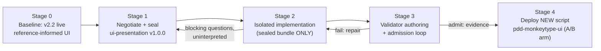

## 4. Method

### 4.1 Roles and Negotiation Protocol

The experiment instantiates three PDD roles as separate agents, plus a validation engineer.

#### 4.1.1 Orchestrator and protocol author

The **orchestrator** is reference-informed: it knows the live v2.2 aesthetic and the study's intent set (positions 1a–1f: word-stream structure, caret, per-letter state, theme charter, exact results, no reflow of committed words; plus budgets: ≤ 14 `must` invariants, cheap validators, substitutability). The **protocol author** knows the bundle anatomy and the CA-001 discipline but receives the orchestrator's intents only through the negotiation channel. Negotiation proceeds in rounds: the orchestrator states positions; the author replies with verdicts (accept / accept-modified / accept-strengthened), pushbacks requiring adjudication (P1–P6), a sealed-vs-delegated ledger, a per-invariant validator-cost estimate, and open questions (Q1–Q4); the orchestrator adjudicates; the author applies adjudications, lints the bundle (`check_bundle.py`: 17 invariants, every `must` validator-mapped), and seals. The orchestrator's round-1 position memo (`research/negotiation/round-01-orchestrator.md`: six persistent intents proposed for sealing, delegated transient cosmetics, the ≤ 14-`must` friction budget, and the substitutability constraint) opens the negotiation; the author's point-by-point counterproposal is `research/negotiation/round-01-author.md`; round-2 adjudication and sealing records are `research/negotiation/round-02-orchestrator.md` and `round-02-author.md`.

#### 4.1.2 Friction accounting

Friction is accounted as a ledger, not an impression: negotiation rounds; blocking questions by CA-001 class (critical vs cosmetic); version events; `must`-invariant count against budget; validator suite size, wall clock, and fix iterations. Post-sealing conformity findings are recorded in the ambiguity log without version events unless normative text changes (`protocols/ui-presentation/ambiguity-log.md`).

### 4.2 Pipeline

Figure 1 shows the five-stage pipeline (`/mnt/agents/work/plan-ui-research.md`).

Figure 1: Experiment pipeline. The loop edges are the only permitted channels: nothing reaches the implementer except sealed bundle text, and nothing reaches admission except validator evidence.

#### 4.2.1 Stage 0 — baseline

Restore checkpoint; the live v2.2 origin (`https://pdd-monkeytype.pdd-typing.workers.dev`, pre-caret) stands as the reference-informed visual baseline for A/B comparison.

#### 4.2.2 Stage 1 — negotiation and sealing

Authoring by the protocol-author agent under the CA-001 discipline; output is the sealed `ui-presentation` bundle (`protocols/ui-presentation/`: protocol.yaml, three invariant files, theme schema, validation plan, validator suite skeleton, evidence requirements, ambiguity log). Transcript preserved in `research/negotiation/`.

#### 4.2.3 Stage 2 — isolated implementation

The implementer receives **only** the sealed bundle and the repository — no visual interpretation, no transcript (`research/implementation/stage-02-report.md`). Critical ambiguities, had any arisen, would be logged as blocking questions and relayed uninterpreted to the author; cosmetic and delegated decisions are logged with their reasoning for author veto via version event rather than guessed silently.

#### 4.2.4 Stage 3 — validator loop

A validation engineer authors the executable suite against the sealed validation plan (substrate: puppeteer-core + headless Chromium, one browser session; 50 fuzz runs default, 200 nightly; viewport 1280×800, deviceScaleFactor 1) (`protocols/ui-presentation/validators/validation-plan.yaml`), captures the O-UI-005 baseline from the v2.2 lineage on the pinned host image, then loops the candidate to admission. Suite hygiene checks guard the validators themselves: an engine-state oracle cross-checked against the repository engine over 25 seeded streams, a mutation-sanity step that corrupts one letter class and requires detection, and a pass-path shim proving the caret check can pass (`research/metrics/validator-authoring.md`).

#### 4.2.5 Stage 4 — deployment

The conformant build is deployed as a **new** Cloudflare Workers script `pdd-monkeytype-ui` alongside the untouched baseline `pdd-monkeytype`, using the KV-staged hash-gated transfer pattern (per-chunk SHA-256 gates, server-side assembly, full-bundle hash verification before upload) established after the v2.2 chunk-corruption postmortem (`docs/09-cloudflare-deployment.md`, `research/metrics/deployment.md`). Both scripts share one KV namespace, so the pair functions as a live A/B arm over common accounts, results, and quotes.

### 4.3 Interpretive Firewall and Data Sources

The interpretive firewall is the methodological crux: the implementer never sees the negotiation transcript and the orchestrator never annotates the bundle for the implementer. All findings below derive from artifacts produced under this rule: the negotiation transcript (`research/negotiation/`), the implementation report and blocking-question log (`research/implementation/`), validator authoring and loop metrics (`research/metrics/validator-authoring.md`, `validator-loop.md`), the deployment record (`research/metrics/deployment.md`), harness outputs (`harness/out/`, `evidence/admission-summary.json`), and the sealed bundle itself (`protocols/ui-presentation/`). Numbers quoted below are taken from these artifacts verbatim.
